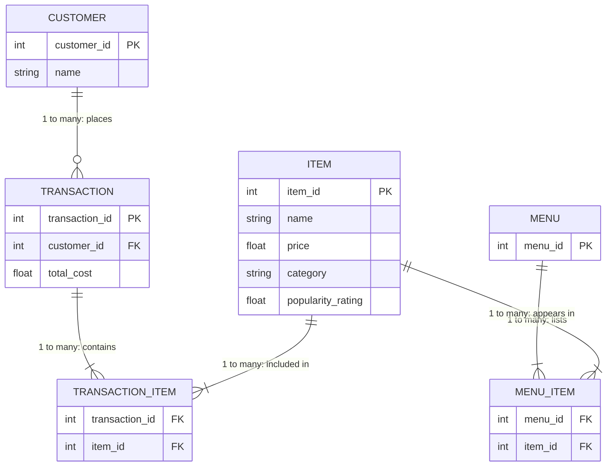

### Final Diagram

```mermaid
erDiagram
    CUSTOMER {
        int customer_id PK
        string name
    }

    ITEM {
        int item_id PK
        string name
        float price
        string category
        float popularity_rating
    }

    MENU {
        int menu_id PK
    }

    TRANSACTION {
        int transaction_id PK
        int customer_id FK
        float total_cost
    }

    MENU_ITEM {
        int menu_id FK
        int item_id FK
    }

    TRANSACTION_ITEM {
        int transaction_id FK
        int item_id FK
    }

    CUSTOMER ||--o{ TRANSACTION : "1 to many: places"
    TRANSACTION ||--|{ TRANSACTION_ITEM : "1 to many: contains"
    ITEM ||--|{ TRANSACTION_ITEM : "1 to many: included in"
    MENU ||--|{ MENU_ITEM : "1 to many: lists"
    ITEM ||--|{ MENU_ITEM : "1 to many: appears in"
```