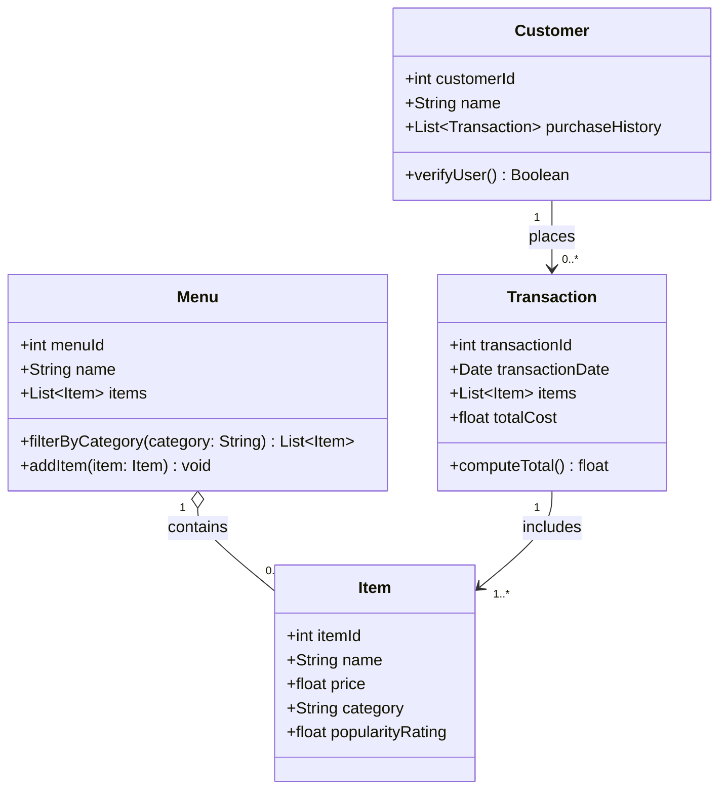

### Final Diagram

```mermaid
classDiagram
    class Customer {
        +int customerId
        +String name
        +List~Transaction~ purchaseHistory
        +verifyUser() Boolean
    }

    class Item {
        +int itemId
        +String name
        +float price
        +String category
        +float popularityRating
    }

    class Menu {
        +int menuId
        +String name
        +List~Item~ items
        +filterByCategory(category: String) List~Item~
        +addItem(item: Item) void
    }

    class Transaction {
        +int transactionId
        +Date transactionDate
        +List~Item~ items
        +float totalCost
        +computeTotal() float
    }

    Customer "1" --> "0..*" Transaction : places
    Menu "1" o-- "0..*" Item : contains
    Transaction "1" --> "1..*" Item : includes
```